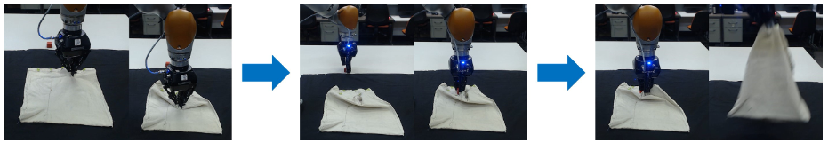
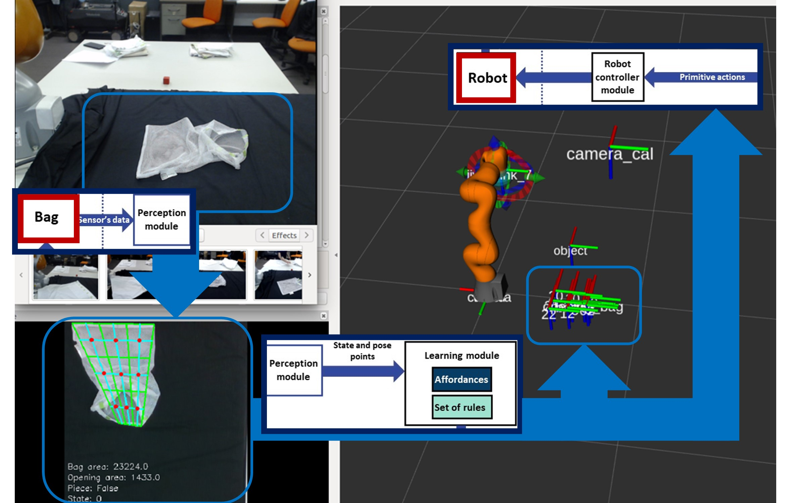
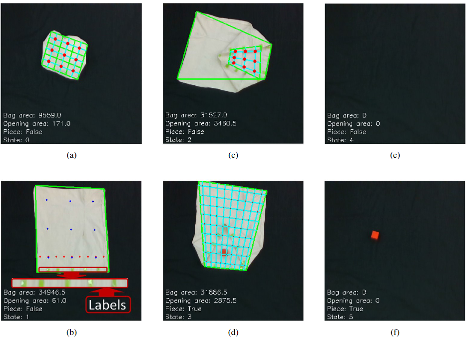
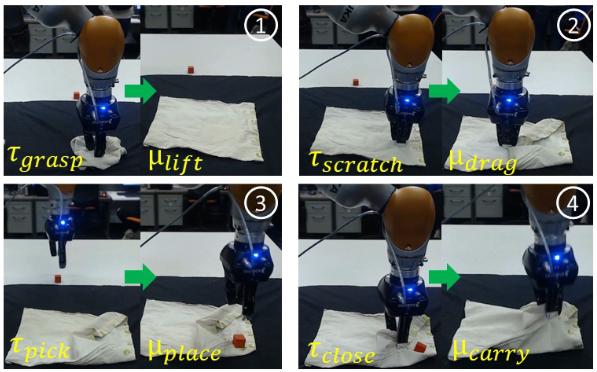
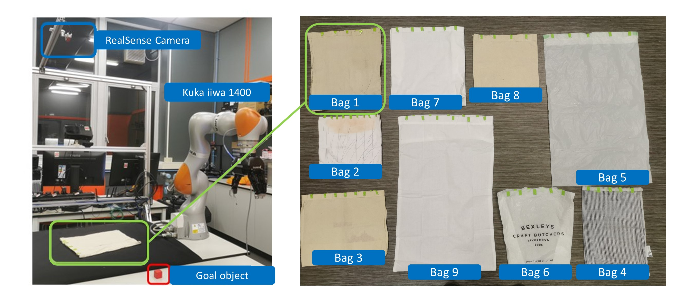

# LearningToBag

This package presents a learning-based framework meant to equip robots with the necessary skills to learn and execute bagging tasks on a simulation-free basis. Here, we utilize a reinforcement learning algorithm, which helps discover optimal grasping points on the bag. The package encapsulates the bagging task through a series of primitive actions and articulates the learning process across five distinct states. This package is intended for people interested in robotic manipulation of deformable objects and runs under a Robot Operating System (ROS) environment.


<p align="center">
    
</p>


<p align="center">
  <a href="https://youtu.be/UV9HcEummx0">
    
  </a>
</p>


# Bag state representation

The picture below breaks down the bagging job into five states, with the red and blue dots marking where the robot can grab. Picture (a) shows the bag all folded up, so you can't see the opening. Then in (b), the bag is unfolded, and you can see the opening. Jump to (c), and now the opening's big enough to toss something in. Check out (d) — that's when the thing is inside, setting it apart from the rest. Now, in (e), we're celebrating because the robot aced it. The table's empty, and the robot's got both the bag and the thing. But, oh no, look at (f). That's a fail. The robot nabbed the bag, but the red cube's still chilling on the table. Tough luck!

<p align="center">
  
</p>

# Primitive actions 

The robot executes the bagging task in four sequential steps. Initially, the robot unfolds the bag in the first step. Subsequently, in the second step, the robot opens the bag. The third step involves the robot inserting the red cube into the bag's opening. Finally, in the fourth step, the robot carries the bag, accomplishing the entire task. For each step, a pair of primitive actions is executed. The robot's primitive actions are defined as follows:

- **Grasping Action $\tau_{grasp}$:** Involves the robot grasping two layers of the bag.
- **Lifting Action $\mu_{lift}$:** Occurs when the bag is raised above the table and dropped to unfold it.
- **Scratching Action $\tau_{scratch}$:** Involves the robot grasping only one layer of the bag.
- **Dragging Action $\mu_{drag}$:** Takes place when the robot moves a grasped layer point to a designated placing point.
- **Picking Action $\tau_{pick}$ and Placing Action $\mu_{place}$:** Refer to picking and placing the red object, respectively.
- **Closing Action $\tau_{close}$:** Grasps one layer of the bag when the object is placed in the opening.
- **Carrying Action $\mu_{carry}$:** Lifts the bag to grab the object.

The following video shows the robot executing the primitive actions:

<p align="center">
  <a href="https://www.youtube.com/watch?v=rdjU4aOT5L0">
    
  </a>
</p>

# Training

The proposed framework is designed for learning in the real world without the crutch of simulations, aiming to pinpoint the optimal grasping points for seamless transitions across distinct bag states. In a departure from conventional methods that often rely on simulated environments, this framework directly engages with the complexities of the physical world. By leveraging real-world interactions, the system dynamically adapts and refines its understanding of the optimal points for grasping. The framework's emphasis on simulation-free learning underscores its commitment to practical applicability, making it a promising avenue for advancing robotic capabilities in handling tasks, such as bagging, with real-world efficacy. The whole training process takes around 3 hours. The following video shows the robot training:

<p align="center">
  <a href="https://www.youtube.com/watch?v=stVUH-i-5V8">
    
  </a>
</p>

# Generalization capabilities

The model, after being trained, was tested with several bags of different sizes and materials. While it performed decently for cotton and small bags, it did not manage to handle plastic bags and large bags. The following video shows the robot performing the task with several bags:

<p align="center">
  <a href="https://youtu.be/uKf_AiQcG3Q">
    
  </a>
</p>

# Current limitations of the framework

So, let's talk about the problems we found in our framework. First off, unfolding the bag can be a bit tricky. If the bag is too big or the opening plays hide and seek, our framework struggles to handle it all smoothly.

Then, there's the opening part. The robot sometimes gets stuck because the bag material doesn't like to change shape, especially with plastic bags. Or, to make things interesting, the robot might end up grabbing two layers instead of one. And besides that, the robot can also drag the whole bag instead of opening it. The following video shows some of the most common failures while utilising our approahc:

<p align="center">
  <a href="https://youtu.be/8RU5C9uFk2k">
    
  </a>
</p>

Another problem is the camera! RealSense is good, but not perfect. A tiny 1 mm difference and it gets all confused, either grabbing too much or not grabbing anything at all.

Lastly, recognizing the bag's opening is like finding a needle in a haystack, especially when there are no handles. The camera has to do some serious detective work, and even humans struggle with it. We've all been there, spinning the bag around a few times before spotting the opening. So, yeah, we've got our challenges to tackle!

# Acknowledgment

<details>
  <summary><b>Paper</b></summary>

  Munguia-Galeano, F., Zhu, J., Hernández, J. D., & Ji, Z. (2023). [Learning to bag with a simulation-free reinforcement learning framework for robots](https://arxiv.org/abs/2310.14398). *arXiv preprint arXiv:2310.14398*.

  ```bibtex
  @article{munguia2023learning,
    title={Learning to bag with a simulation-free reinforcement learning framework for robots},
    author={Munguia-Galeano, Francisco and Zhu, Jihong and Hern{\'a}ndez, Juan David and Ji, Ze},
    journal={arXiv preprint arXiv:2310.14398},
    year={2023}
  }

